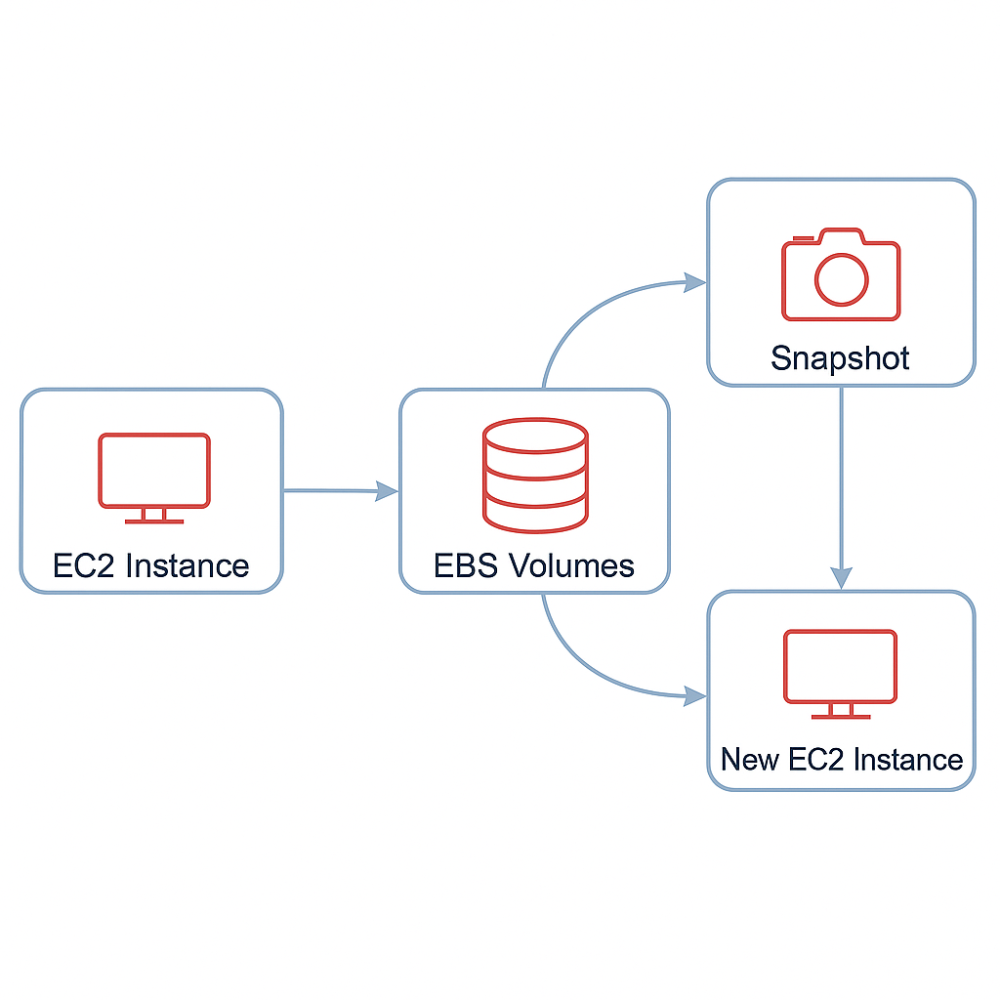

# 🖥️ AWS EC2 & EBS Lifecycle Project

## 📌 Project Objective
This project demonstrates how to:
- Launch an EC2 instance with proper IAM and networking for Session Manager.
- Create, attach, format, and mount EBS volumes.
- Create and restore snapshots.
- Preserve the root volume after terminating an instance.
- Verify data persistence across instances.
- Clean up resources to avoid unwanted charges.

---

## 📸 Architecture Diagram


---

## 🛠 Prerequisites
- AWS Free Tier account.
- Default VPC in the region.
- IAM role with `AmazonSSMManagedInstanceCore` policy attached to the instance.

---

## 🚀 Step-by-Step Guide

### ✅ Step 1 – Create IAM Role
Create a role named **EC2-SSM-Role** with the policy `AmazonSSMManagedInstanceCore`.

---

### ✅ Step 2 – Launch EC2 Instance
- Name: `ebs-project-instance`
- AMI: Amazon Linux 2 (Free Tier)
- Instance Type: t2.micro
- Auto-assign Public IP: ✅ Enabled
- IAM Role: `EC2-SSM-Role`
- **Uncheck "Delete on Termination" for the root volume.**

---

### ✅ Step 3 – Connect Using Session Manager
Connect to the instance via **Session Manager** (no SSH keys needed).

---

### ✅ Step 4 – Create Two EBS Volumes
Create two 1GB gp3 volumes in the **same AZ** as the instance.

📸 Screenshot:  


---

### ✅ Step 5 – Attach Volumes
Attach the volumes as `/dev/sdf` and `/dev/sdg`.

📸 Screenshot:  


---

### ✅ Step 6 – Create an Unattached Volume
Create another 1GB gp3 volume but **do not attach it**.

📸 Screenshot:  


---

### ✅ Step 7 – Format & Mount Volumes
```bash
lsblk
sudo mkfs -t ext4 /dev/xvdf
sudo mkfs -t ext4 /dev/xvdg
sudo mkdir /data1 /data2
sudo mount /dev/xvdf /data1
sudo mount /dev/xvdg /data2
echo "Test File" | sudo tee /data1/file1.txt
echo "Another File" | sudo tee /data2/file2.txt
